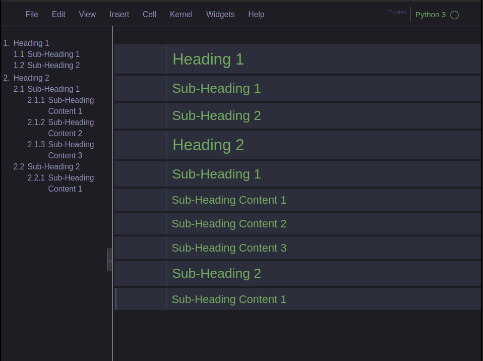
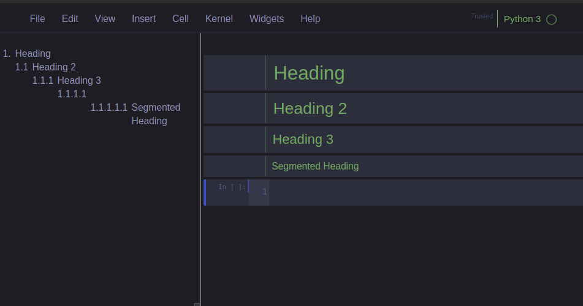
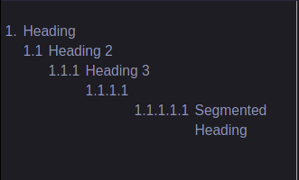

# jupyter-navbar

## Overview

A handy navigation pane for Jupyter Notebook.
Jupyter-navbar searches for headers written in markdown cells,
and displays links to them in the sidebar in a hierarchical fashion. The sidebar is resizable and collapsible.

  <p float="left">
  
</p>

## Installation

Using setup.py

1. Clone or download/extract jupyter-navbar

```sh
git clone https://github.com/henrylao/jupyter-navbar.git
```

2. Run `python setup.py` from within the directory

```sh
python setup.py
```

**Note:** the code in `setup.py` was tested using Python 2.7, but should work on Python 3 as well. If you have any trouble, you may proceed to manual installation.

## Manual installation

1. Either clone or download/extract jupyter-navbar
2. Locate the `.jupyter` directory, which should be inside your home directory:
   - In Linux: `~/.jupyter`
   - In Windows: `%HOMEPATH%\.jupyter`
3. Copy `navbar.css` and `navbar.js` to `.jupyter/custom/jupyter-navbar/` (create directories as needed)
4. Copy and paste the following code into `.jupyter/custom/custom.js` (create file if it doesn't exist):

   $.getScript("/custom/jupyter-navbar/navbar.js");

5. Copy and paste the following code _at the very top_ of `.jupyter/custom/custom.css` (create file if it doesn't exist):

   @import url("jupyter-navbar/navbar.css");

The code in `custom.css` and `custom.js` gets automatically executed when a notebook is loaded. In turn, the navbar code gets called.

## Usage

### Example

The navbar displayed is in accordance to the number of '#' before the text of the markdown heading. Fewer '#' denote a higher precedence in the navbar rendered.

  <p float="left">
  
</p>

### Some Undesirable Effects

The current implementation assumes there exists '#' at each step of a heading when generating the navbar.

  <p float="left">
  
</p>

Inclusion of an extra '#' results in sections in the navbar being generated without a title.

  <p float="left">
  
</p>

## Compatibility with jupyter-themes

The third-party package [jupyter-themes](https://github.com/dunovank/jupyter-themes) changes the design of Jupyter notebooks. It does so by overwriting the contents of `custom.css`. When installing jupyter-navbar, you should add the `@import` code to the top of the file. When changing a theme, you will need to add it again, since the CSS file gets replaced. This can be done either manually, or by running `setup.py` again.
